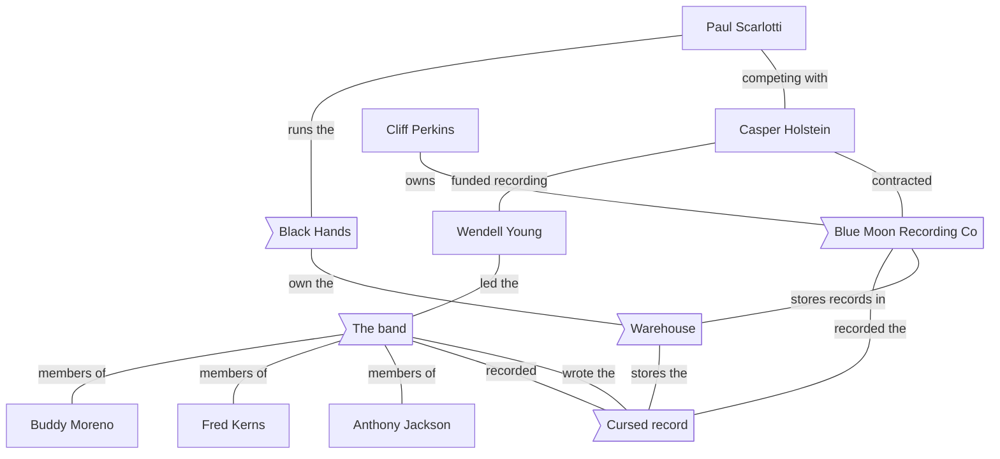

Key:

```mermaid
graph TD;
Person["A person"]
Thing>"A place or thing"]
```
Relationship map:

```mermaid
graph TD;
    WendellYoung["Wendell Young"];
    
    TheBand>"The band"];
    
    WendellYoung -- led the --- TheBand
    
    BuddyMoreno["Buddy Moreno"];
    FredKerns["Fred Kerns"];
    AnthonyJackson["Anthony Jackson"]

    TheBand -- members of --- BuddyMoreno & FredKerns & AnthonyJackson

    CursedRecord>"Cursed record"];
    Warehouse>Warehouse]
    
    TheBand -- recorded --- CursedRecord

    BlueMoon>"Blue Moon Recording Co"]
    BlackHands>"Black Hands"]
    
    BlueMoon -- recorded the --- CursedRecord;
    
    TheBand -- wrote the --- CursedRecord
    Warehouse -- stores the --- CursedRecord
    CasperHolstein["Casper Holstein"]
    
    CasperHolstein -- funded recording --- WendellYoung
    
    CliffPerkins["Cliff Perkins"];
    CliffPerkins -- owns --- BlueMoon
    
    CasperHolstein -- contracted --- BlueMoon
    
    PaulScarlotti["Paul Scarlotti"]
    PaulScarlotti -- runs the --- BlackHands
    BlackHands -- own the --- Warehouse
    BlueMoon -- stores records in --- Warehouse
    
    PaulScarlotti -- competing with --- CasperHolstein
```