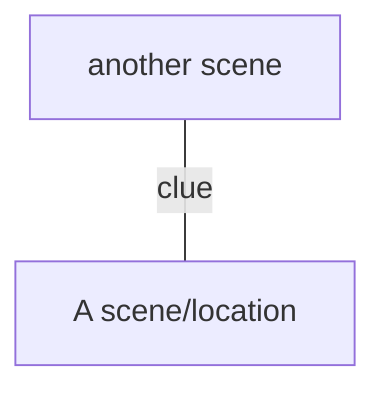
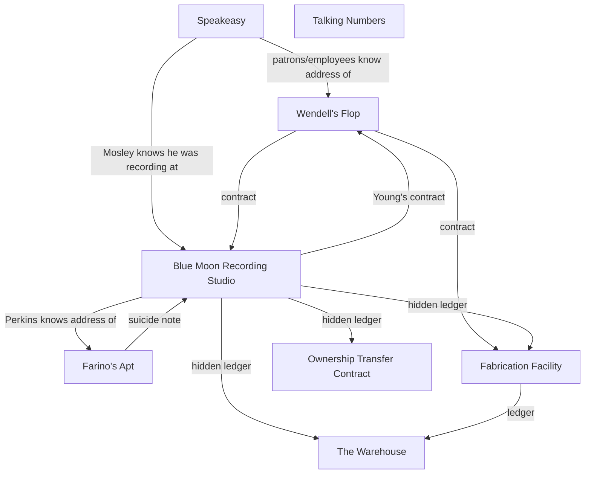

Key:

```mermaid
graph TD;
Scene["A scene/location"]
AnotherScene["another scene"] -- "clue" --- Scene
```

Scenes and clues:

```mermaid
graph TD;
    Speakeasy;
    WendellApt["Wendell's Flop"];
    FarinoApt["Farino's Apt"];
    TalkingNumbers["Talking Numbers"]
    RecordStudio["Blue Moon Recording Studio"];
    ProdFact["Fabrication Facility"];
    Warehouse["The Warehouse"];
    HandoutOwnershipTransfer["Ownership Transfer Contract"]
    
    Speakeasy -- patrons/employees know address of --> WendellApt;
    Speakeasy -- Mosley knows he was recording at --> RecordStudio

    WendellApt -- contract ---> RecordStudio
    WendellApt -- contract ---> ProdFact

    RecordStudio -- Young's contract --> WendellApt;
    RecordStudio -- Perkins knows address of --> FarinoApt;

    RecordStudio -- hidden ledger --> ProdFact & Warehouse & HandoutOwnershipTransfer;   
    
    FarinoApt -- suicide note --> RecordStudio
    
    ProdFact -- ledger --> Warehouse
```